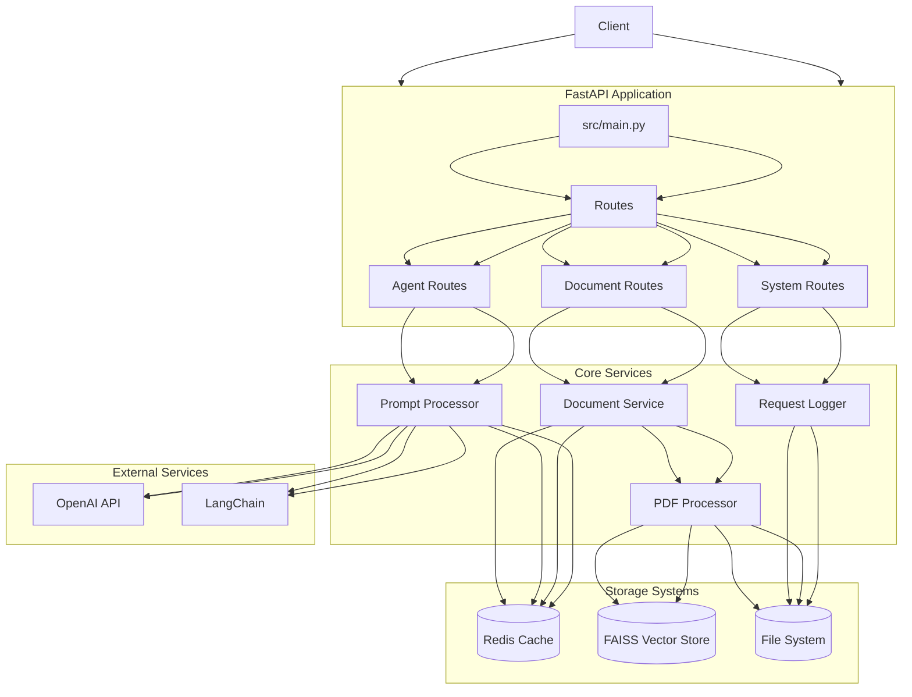

# LangChain Agent API Project

A FastAPI-based application that provides an API for document processing, LangChain agent interactions, and conversational AI capabilities.

## Project Overview

This project creates a robust API service that combines document processing, vector storage, and LLM-powered interactions. It's designed to process documents (particularly PDFs), store their content in a searchable format, and provide intelligent responses using LangChain and OpenAI's APIs.

## Architecture

The project follows a modular architecture with several key components:




### Core Components
- `src/main.py` - Application entry point and FastAPI configuration
- `src/routes/` - API endpoint definitions
- `src/services/` - Core business logic services
- `src/config/` - Configuration settings

### Key Features

1. **Document Processing**
   - PDF processing and text extraction
   - Document chunking and embedding generation
   - Vector storage using FAISS
   - Searchable document repository

2. **Logging System**
   - Request/response logging in Markdown format
   - Service interaction recording
   - Performance metrics tracking

3. **API Features**
   - Document upload and management
   - Text search and similarity matching
   - Chat interactions with context awareness
   - Feedback collection
   - Health monitoring and metrics

## Setup and Installation

1. **Environment Setup**:
```bash
# Create virtual environment
python -m venv venv
source venv/bin/activate  # Linux/Mac
# or
.\venv\Scripts\activate  # Windows
```

2. **Install Dependencies**:
```bash
pip install -r requirements.txt
```

3. **Configure Environment**:
Create a `.env` file with:
```env
OPENAI_API_KEY=your_key_here
LANGCHAIN_API_KEY=your_key_here
LANGCHAIN_PROJECT=your_project_name
REDIS_HOST=localhost
REDIS_PORT=6379
MODEL_NAME=gpt-4
TEMPERATURE=0.7
```

4. **Start Redis**:
```bash
# Linux/Mac
sudo service redis-server start
# or using Docker
docker run -d -p 6379:6379 redis
```

## Usage

1. **Start the Server**:
```bash
python src/main.py
```

2. **Available Endpoints**:

- Document Management:
  - `POST /documents/upload` - Upload new documents
  - `GET /documents/status/{doc_id}` - Check document processing status
  - `GET /documents/list` - List all documents
  - `POST /documents/search/{doc_id}` - Search within a document

- Agent Interactions:
  - `POST /agent/chat` - Chat with the knowledge agent
  - `POST /agent/execute` - Execute specific agent tasks

- System:
  - `GET /metrics` - System metrics
  - `GET /health` - Health check

## Utility Scripts

The project includes several utility scripts:

- `setup.sh` - Initial project setup
- `quick_check.sh` - System dependency verification
- `view_logs.sh` - Log viewing utility
- `manage_records.sh` - Service record management

## Features Explanation

### Document Processing Pipeline
1. Document Upload
   - Files are saved to disk
   - Text is extracted and chunked
   - Chunks are embedded using OpenAI's embedding model
   - Embeddings are stored in FAISS vector store

### Intelligent Search
- Uses similarity search on document embeddings
- Provides context-aware responses
- Maintains conversation history
- Uses LangChain for advanced prompt processing

### Monitoring and Logging
- Request/response logging
- Performance metrics
- Error tracking
- Service health monitoring

## Production Considerations

1. **Scaling**:
   - Redis for caching and rate limiting
   - FAISS for efficient vector search
   - Background task processing for document handling

2. **Security**:
   - API key management
   - Rate limiting
   - Input validation
   - Secure file handling

3. **Monitoring**:
   - Prometheus metrics
   - Request logging
   - Error tracking
   - Performance monitoring

## Contributing

1. Fork the repository
2. Create your feature branch
3. Commit your changes
4. Push to the branch
5. Create a new Pull Request

## License

[MIT License](LICENSE)